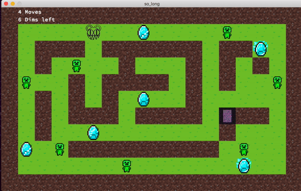

## So_long

## Game Preview

 

    

So_Long is a simple 2D game built in C as a programming project. It is a part of the 42 curriculum and it's the first graphics project that aims to provide an introduction to game development and graphics programming.

The game features a player-controlled character navigating through a maze-like environment filled with obstacles and collectible items. The objective of the game is to collect all the items and reach the exit while avoiding or overcoming obstacles.

This project serves as a practical exercise in various programming concepts, including input handling, game logic, path finding ,collision detection, rendering, and more. It provides an opportunity to apply knowledge and skills in a fun and interactive way.

## Features

- Player Movement: The game allows the player character to move in four directions (up, down, left, right) within the game world.
- Path Finding: The game implements a path finding algorithm to allow the player to navigate the maze or chack if the map is valid.
- Obstacles: The game includes various types of obstacles such as walls or enemies that the player must navigate around.
- Collectibles: The player can collect items scattered throughout the maze to open the portal.
- Collision Detection: So_Long incorporates collision detection mechanisms to ensure the player character interacts correctly with obstacles and collectibles.
- Graphics and Rendering: The game utilizes basic graphical elements and rendering techniques to display the game world.
- Win/Lose Conditions: It implements win and lose conditions, such as collecting all items and reaching the exit, or colliding with certain obstacles.

## Usage
the program takes a map as an argument and displays it on the screen. The map is a rectangular shape composed of different characters representing the following elements:
1. `0` for an empty space
2. `1` for a wall
3. `C` for a collectible item
4. `E` for the exit
5. `P` for the player's starting position
6. `*` for an enemy

The program must take a map with the `.ber` extension as a parameter. If the map is invalid, the program will exit properly.

` ./so_long map.ber` or `./so_long_bonus map.ber`